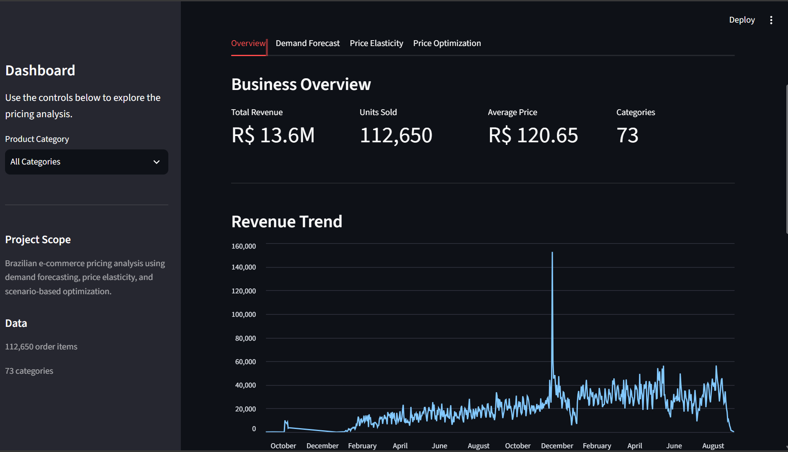

# AI-Powered Pricing Optimization & Revenue Forecasting System

An end-to-end pricing analytics pipeline built on the Olist Brazilian e-commerce dataset. It forecasts near-term demand, estimates how price-sensitive different product categories actually are, and simulates expected revenue across alternative pricing scenarios — all explorable through an interactive Streamlit dashboard.

---

##  Business Problem

E-commerce businesses have to balance three things at once: **price**, **demand**, and **revenue**. Set prices too high and volume drops; set them too low and margin is left on the table — and getting this right requires knowing how demand actually responds to price, which static pricing ignores entirely.

This project works through three connected questions using historical transaction data:

1. How much demand can be expected in the near term?
2. How sensitive is that demand to price, and does this differ by category?
3. Which pricing scenarios could plausibly improve expected revenue?

---

##  Project Objective

- Forecast near-term aggregate demand and evaluate it on a genuine holdout period
- Estimate price elasticity of demand using panel data methods, not a naive correlation
- Quantify price sensitivity separately by product category, rather than assuming one number fits the catalog
- Translate elasticity estimates into revenue scenarios across a bounded, realistic price range
- Flag which scenarios are statistically reliable and which aren't, as decision support — not a guaranteed answer

---

##  Dataset

The [Olist Brazilian E-Commerce dataset](https://www.kaggle.com/datasets/olistbr/brazilian-ecommerce) is the only data source used in this project. The pipeline draws on the orders, order items, products, sellers, customers, and product-category-translation tables to build a single order-item-level analytical dataset.

After cleaning and merging, that dataset contains **112,650 order items across 98,666 unique orders**, spanning September 2016 to September 2018.

---

##  Project Workflow

| Stage | What I Did | Notebook |
|---|---|---|
| Data Understanding | Loaded and profiled all raw Olist tables — shape, dtypes, missing values, duplicates | `01_data_understanding.ipynb` |
| Data Cleaning | Handled missing values and validated duplicate/composite keys per table | `02_data_cleaning.ipynb` |
| Master Dataset | Merged tables into one order-item-level dataset, validating row count at every join | `03_master_dataset.ipynb` |
| Feature Engineering | Built calendar, pricing, and historical panel features with outlier capping and row-count checks | `04_feature_engineering.ipynb` |
| Demand Forecasting | Aggregated to a daily series and compared Prophet vs. XGBoost on a 30-day holdout | `05_demand_forecasting.ipynb` |
| Price Elasticity | Estimated a two-way fixed-effects elasticity model on a product-category-month panel | `06_price_elasticity.ipynb` |
| Price Optimization | Simulated expected revenue across candidate prices for each eligible category | `07_price_optimization.ipynb` |

---

##  Key Results

## 1. Demand Forecasting

Order-item transactions are aggregated into a daily demand series and forecast using two approaches, evaluated on a **chronological 30-day holdout** (never seen during training):

- **Prophet**, with weekly seasonality
- **XGBoost**, using lag and rolling-window features, forecast recursively so each day's own prediction — not the real future value — feeds the next day's lag

| Metric / Result | Value |
|---|---:|
| Holdout period | 30 days |
| Actual demand (total) | 5,945 |
| Forecasted demand (total) | 7,852 |
| Forecast difference | +32.1% |
| Selected model | XGBoost |

XGBoost was selected on lowest RMSE against Prophet and is the model used in the dashboard. The **+32.1% figure is the difference between total forecasted and total actual demand summed over the 30-day holdout** — it is not a forecast accuracy score, and the notebook's actual per-day error metrics (MAE, RMSE, WAPE, sMAPE) are what characterize how close the day-by-day forecast tracked reality.

## 2. Price Elasticity Analysis

Price elasticity is estimated on a **product-category-month panel** — item-level transactions aggregated to categories, using only months a product actually sold, with no zero-demand months invented. Only products with enough repeat sales and enough price variation are kept for estimation, following a two-way fixed-effects log-log model:

```
log(demand) = product fixed effects + month fixed effects + β·log(price) + ε
```

fit with clustered standard errors at the product level.

| Metric | Value |
|---|---:|
| Elasticity (β) | -1.0132 |
| Clustered SE | 0.0995 |
| 95% CI | [-1.208, -0.818] |
| Within R² | 0.0264 |
| Observations | 8,816 |
| Products | 1,062 |

The estimate points to an inverse price-demand relationship close to unit-elastic in the analyzed sample. **This is an observational estimate, not a causal one** — Olist transaction data was not generated by a pricing experiment, and while product and time fixed effects control for a lot, they don't rule out every confounder (seasonality, promotions, seller behavior).

## 3. Category-Level Price Sensitivity

16 product categories had enough observations and products to estimate individually.

| Category | Elasticity | Reliability |
|---|---:|---|
| moveis_escritorio (most price-sensitive) | -2.571 | moderate |
| relogios_presentes | -1.767 | reliable |
| cama_mesa_banho | -1.742 | reliable |
| beleza_saude (least price-sensitive, detectable negative) | -0.776 | reliable |
| papelaria | +0.134 | positive / likely confounded |

Across all 16: **4 reliable, 7 moderate, 4 not detected, 1 positive/likely confounded** (a positive coefficient contradicts standard downward-sloping demand and is flagged as probable confounding rather than reported as "low sensitivity"). Not every category has a usable elasticity estimate — that's a real finding of the analysis, not a gap in it, and it's exactly why category-level granularity matters: a single catalog-wide elasticity number would have hidden this variation entirely.

## 4. Price Optimization

Optimization is done at the **category level**, since category is the finest grain at which Phase 6 produced reliable elasticity — no individual product had enough repeat, price-varying sales to support its own estimate.

The demand response model is constant-elasticity:

```
Q(P) = Q0 × (P / P0)^E
```

— expected demand at a candidate price `P`, given baseline demand `Q0` at reference price `P0` and the category's estimated elasticity `E`. Expected revenue is `P × Q(P)`.

Candidate prices are evaluated within **±20% of each category's reference price**. This is a modeling constraint to stay close to the observed pricing range — **not evidence that the true optimal price lies within ±20%.** The project optimizes **expected revenue**, not profit, because the dataset has no reliable product-cost field to optimize against.

Example — `relogios_presentes`, the only category that clears every reliability check:

| Field | Value |
|---|---:|
| Reference price | R$ 201.38 |
| Recommended price | R$ 161.10 |
| Price change | -20.0% |
| Elasticity | -1.767 |
| Expected revenue change | +18.7% |
| Recommendation flag | reliable |

Across all 11 categories eligible for optimization, **10 show their recommended price direction reversing somewhere within the elasticity's own confidence interval** — meaning most computed scenarios are not stable recommendations. Only `relogios_presentes` survives the combined check (Phase 6 reliability, CI-direction stability, and no extrapolation beyond the observed price range). These are scenario-based pricing recommendations derived from an observational elasticity estimate, not guaranteed optimal prices.

## 5. Business Interpretation

- Demand forecasting gives a near-term expectation of order volume, evaluated against a real holdout rather than in-sample fit.
- Price elasticity quantifies how demand has historically moved with price — as an association, not a guarantee of what will happen next.
- Price sensitivity is not uniform: it varies meaningfully across categories, and some categories don't have enough data to say anything reliable at all.
- Elasticity estimates can be converted into revenue scenarios, but the uncertainty in the elasticity itself often dominates the recommendation — as seen in the 10-of-11 sign-flip result above.
- All of this is explorable interactively in the dashboard, category by category.

---

##  Interactive Dashboard

| Dashboard Tab | Purpose |
|---|---|
| Overview | Revenue, units sold, average price, and category breakdown |
| Demand Forecast | Actual vs. forecast demand over the holdout, with MAE/RMSE/WAPE/sMAPE |
| Price Elasticity | Category-level elasticity, confidence intervals, and reliability flags |
| Price Optimization | Reference vs. scenario price, expected revenue change, and recommendation flag |

### Dashboard Overview



---

##  Tech Stack

| Category | Technologies |
|---|---|
| Programming | Python |
| Data Analysis | Pandas, NumPy |
| Visualization | Matplotlib |
| Forecasting / ML | Prophet, XGBoost, Scikit-learn |
| Statistical Modeling | Statsmodels, Linearmodels |
| Model Persistence | Joblib |
| Dashboard | Streamlit |

---

##  Project Structure

```text
ai-pricing-optimization-system/
├── data/
│   ├── raw/                 # raw Olist CSVs (gitignored)
│   └── processed/            # notebook outputs read by the dashboard (gitignored)
├── models/                   # saved model artifacts (gitignored)
├── notebooks/
│   ├── 01_data_understanding.ipynb
│   ├── 02_data_cleaning.ipynb
│   ├── 03_master_dataset.ipynb
│   ├── 04_feature_engineering.ipynb
│   ├── 05_demand_forecasting.ipynb
│   ├── 06_price_elasticity.ipynb
│   └── 07_price_optimization.ipynb
├── dashboard/
│   └── app.py
├── src/
│   ├── data/                 # load_data.py, merge_data.py
│   ├── features/
│   ├── models/
│   ├── api/
│   └── monitoring/
├── infra/
├── requirements.txt
└── README.md
```

---

##  Limitations

- **Observational, not causal.** Elasticity is estimated from historical transactions, not a randomized pricing experiment.
- **Seller and product mix.** For multi-seller products, month-to-month average price can shift because of which seller sold, not because of a genuine price change.
- **No reliable cost data.** Optimization targets revenue, not profit, because the dataset has no defensible product-cost field.
- **Scenario-based, not guaranteed.** Price optimization results are simulations under a constant-elasticity assumption, not predictions of realized outcomes.
- **Uneven reliability.** Several category-level elasticity estimates are flagged `moderate` or `not_detected` — they should not be treated with the same confidence as the `reliable` ones.
- **Extrapolation risk.** Candidate prices near the ±20% boundary can approach or exceed the range of prices actually observed for a category.

---

##  Future Improvements

The following are realistic extensions, not current functionality:

- Causal pricing experiments (e.g. randomized or quasi-experimental price tests) to move beyond observational elasticity
- Richer cost and margin data, to shift optimization from revenue to profit
- Inventory and stock-availability data
- Competitor pricing signals
- Customer segmentation within the elasticity model
- Dynamic, continuously-updated pricing evaluation

---

## ▶ How to Run

```bash
git clone <repository-url>
cd ai-pricing-optimization-system

python -m venv venv

# Windows
venv\Scripts\activate

# Install dependencies
pip install -r requirements.txt

# Run dashboard
python -m streamlit run dashboard/app.py
```

Run notebooks `01` through `07` in order first — each writes the files the next one (and the dashboard) reads from `data/processed/` and `models/`.
